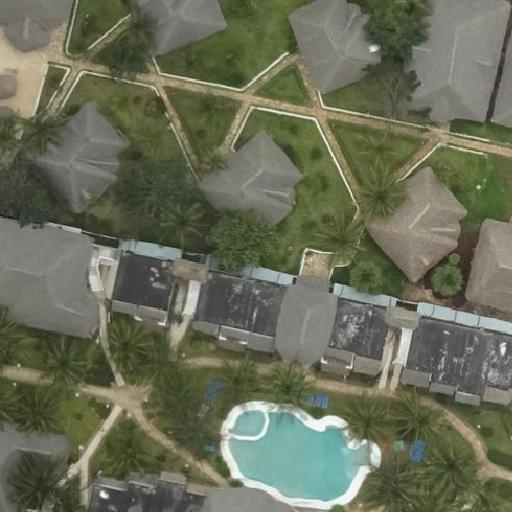
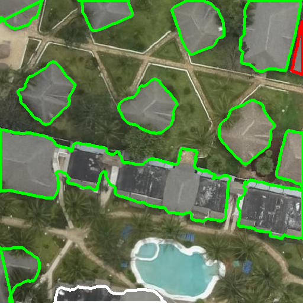

# FINAL YEAR PROJECT CSE_2020

## About the Project

- First segmentation and classification is trained separately.
- Then trained models are stored in pickle file.
- Both segmentation and classification model are used in the flask to build the flask api.
- The main job segmentation model to find all the building inside a image.
- Then the classisication model will classify building(complete,incomplete,foundation or empty).
- The api will produce output for image of size 512x512.
## Final Output

### Input Image
 

### Output Image

## Authors of Code

- GOPAL KRISHNA MISHRA
- SIDHARTH BISAL
- ISHAN AYUS
- BISHNU PRASAD SAHOO
- ATITHEE APOORVA

